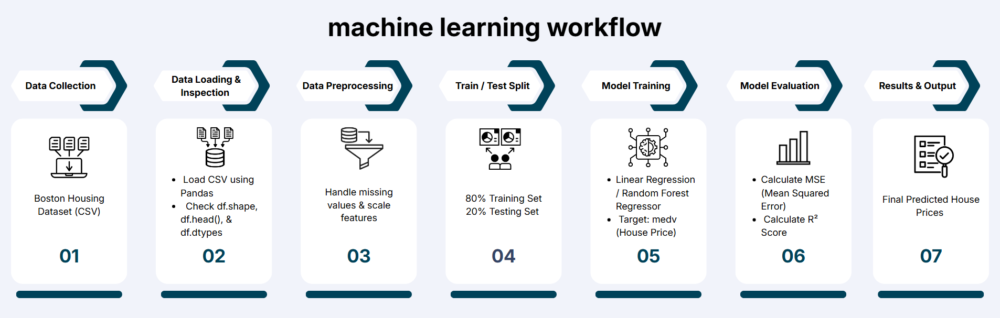

# ARTI 308 - Lab 2: Machine Learning Problem Definition

## Part 1: Problem Definition
- **Problem Type:** Regression
- **Target Variable:** `medv` (Median value of owner-occupied homes in $1000's)
- **Problem Description:** The goal of this project is to build a Machine Learning regression model that predicts house prices based on various features such as crime rate, number of rooms, and property tax rates. 

## Part 2: Open Dataset
- **Dataset Name:** Boston Housing Dataset
- **Source:** Open-source dataset (Tabular CSV format)

## Part 3: Code Implementation
The Jupyter Notebook `lab2_notebook.ipynb` contains the code for loading the dataset using Pandas, viewing its shape, inspecting the first few rows, and checking data types.

## Part 4: Methodology Diagram
Below is the machine learning workflow methodology diagram:

